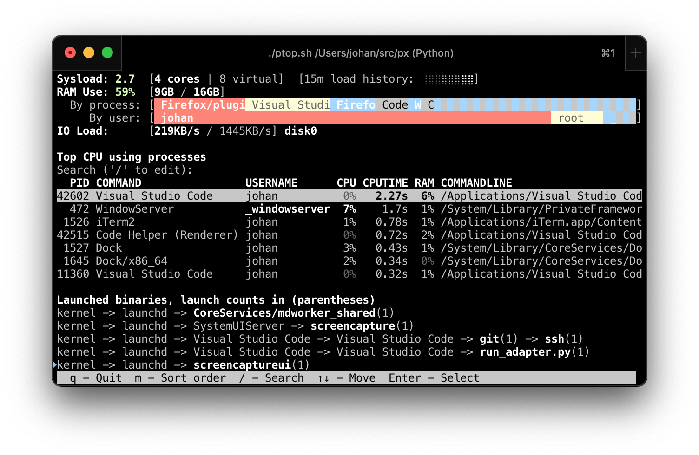

|Build Status|

``ps`` and ``top`` for Human Beings
===================================

Installation
------------
On `Debian 10 Buster`_ or later, and on `Ubuntu 19.04 Disco`_ and later, install using::

  sudo apt-get install px

On other systems (macOs, other Linux distros, ...), install into ``/usr/local/bin`` by
copy / pasting this command into a terminal::

  curl -Ls https://github.com/walles/px/raw/python/install.sh | bash

**Help wanted**: If somebody could `create a macOS Homebrew package`_ that would be super!

Or you can install from Pypi. At least on macOS this can be problematic however,
so the install script above is still preferred::

  sudo pip install --upgrade pxpx

Now, you should be able to run ``px``, ``px --help`` or ``ptop`` from the command
line. Otherwise please verify that ``/usr/local/bin`` is in your ``$PATH``.

To try ``px`` without installing it, just `download the latest px.pex`_,
``chmod a+x px.pex``, then run ``./px.pex``.

Usage
-----
Just type ``px`` or ``ptop``, that's a good start!

To exit ``ptop``, press "``q``".

Also try ``px --help`` to see what else ``px`` can do except for just listing all
processes.

If you run into problems, try running with the ``--debug`` switch, it will print
debug logging output after ``px``/``ptop`` is done.

Output
======

``px``
-------------
Running just ``px`` lists all running processes, with the most interesting ones last.
Output truncated for brevity.

::

   PID COMMAND                           USERNAME           CPU CPUTIME RAM COMMANDLINE
     0 kernel                            root                --      --  -- kernel PID 0
   273 SandboxHelper                     _coreaudiod         0%   0.01s  0% /System/Library/Frameworks/AudioToolbox.framework/XPCServices/com.apple.audio.SandboxHelper.xpc/Contents/MacOS/com.apple.audio.SandboxHelper
   596 installerdiagd                    root                0%   0.01s  0% /System/Library/PrivateFrameworks/InstallerDiagnostics.framework/Versions/A/Resources/installerdiagd
   983 periodic-wrapper                  root                0%   0.01s  0% /usr/libexec/periodic-wrapper daily
     ...
 57417 Google Chrome Helper              johan               0%   1m03s  2% /Applications/Google Chrome.app/Contents/Versions/70.0.3538.102/Google Chrome Helper.app/Contents/MacOS/Google Chrome Helper --type=renderer --field-trial-handle=5536258455526146518,14669732848005555331,131072 --service-pipe-token=7224348701576210538 --lang=sv --metrics-client-id=576E1A60-CA59-34F4-6C0C-57F64BD5F01C --enable-offline-auto-reload --enable-offline-auto-reload-visible-only --num-raster-threads=4 --enable-zero-copy --enable-gpu-memory-buffer-compositor-resources --enable-main-frame-before-activation --service-request-channel-token=7224348701576210538 --renderer-client-id=1119 --no-v8-untrusted-code-mitigations --seatbelt-client=418
 14983 studio                            johan               0%   1h22m 14% /Applications/Android Studio.app/Contents/MacOS/studio
 57993 kcm                               root                0%   0.02s  0% /System/Library/PrivateFrameworks/Heimdal.framework/Helpers/kcm --launchd
 57602 Code Helper                       johan               0%  12.73s  2% /private/var/folders/cg/d7qzk4s13s9c8t49t3txdjpr0000gn/T/AppTranslocation/B5DDDD81-5A91-4961-B18B-20DAB3925EB0/d/Visual Studio Code.app/Contents/Frameworks/Code Helper.app/Contents/MacOS/Code Helper --type=renderer --js-flags=--nolazy --no-sandbox --primordial-pipe-token=570B948A976AACDA8EBB532E5680C83E --lang=sv --app-path=/private/var/folders/cg/d7qzk4s13s9c8t49t3txdjpr0000gn/T/AppTranslocation/B5DDDD81-5A91-4961-B18B-20DAB3925EB0/d/Visual Studio Code.app/Contents/Resources/app --node-integration=true --webview-tag=true --no-sandbox --background-color=#171717 --disable-blink-features=Auxclick --enable-pinch --num-raster-threads=4 --enable-zero-copy --enable-gpu-memory-buffer-compositor-resources --enable-main-frame-before-activation --content-image-texture-target=0,0,3553;0,1,3553;0,2,3553;0,3,3553;0,4,3553;0,5,3553;0,6,3553;0,7,3553;0,8,3553;0,9,3553;0,10,34037;0,11,34037;0,12,34037;0,13,3553;0,14,3553;0,15,3553;1,0,3553;1,1,3553;1,2,3553;1,3,3553;1,4,3553;1,5,3553;1,6,3553;1,7,3553;1,8,3553;1,9,3553;1,10,34037;1,11,34037;1,12,34037;1,13,3553;1,14,3553;1,15,3553;2,0,3553;2,1,3553;2,2,3553;2,3,3553;2,4,3553;2,5,3553;2,6,3553;2,7,3553;2,8,3553;2,9,3553;2,10,34037;2,11,34037;2,12,34037;2,13,3553;2,14,3553;2,15,3553;3,0,3553;3,1,3553;3,2,3553;3,3,3553;3,4,3553;3,5,34037;3,6,3553;3,7,3553;3,8,3553;3,9,3553;3,10,3553;3,11,3553;3,12,34037;3,13,3553;3,14,34037;3,15,34037;4,0,3553;4,1,3553;4,2,3553;4,3,3553;4,4,3553;4,5,34037;4,6,3553;4,7,3553;4,8,3553;4,9,3553;4,10,3553;4,11,3553;4,12,34037;4,13,3553;4,14,34037;4,15,34037 --service-request-channel-token=570B948A976AACDA8EBB532E5680C83E --renderer-client-id=110
 57996 cat                               johan               0%    0.0s  0% cat
 57745 GradleDaemon                      johan               0%  32.75s  3% /Library/Java/JavaVirtualMachines/jdk1.8.0_60.jdk/Contents/Home/bin/java -Xmx1536m -Dfile.encoding=UTF-8 -Duser.country=SE -Duser.language=sv -Duser.variant -cp /Users/johan/.gradle/wrapper/dists/gradle-4.6-all/bcst21l2brirad8k2ben1letg/gradle-4.6/lib/gradle-launcher-4.6.jar org.gradle.launcher.daemon.bootstrap.GradleDaemon 4.6

* To give you the most interesting processes close to your next prompt, ``px``
  puts last in its output processes that:

  * Have been started recently (can be seen in the list as high PIDs)

  * Are using lots of memory

  * Have used lots of CPU time

* Java processes are presented as their main class (``GradleDaemon``) rather
  than as their executable (``java``). `This support is available for many VMs`_.

``px java``
-----------
This lists all Java processes. Note how they are presented as their main class
(``GradleDaemon``) rather than as their executable (``java``). `This support is available for many VMs`_.

::

   PID COMMAND      USERNAME CPU CPUTIME RAM COMMANDLINE
 57745 GradleDaemon johan     0%  35.09s  3% /Library/Java/JavaVirtualMachines/jdk1.8.0_60.jdk/Contents/Home/bin/java -Xmx1536m -Dfile.encoding=UTF-8 -Duser.country=SE -Dus

``px _coreaudiod``
------------------
This lists all processes owned by the ``_coreaudiod`` user.

::

 PID COMMAND       USERNAME    CPU CPUTIME RAM COMMANDLINE
 273 SandboxHelper _coreaudiod  0%   0.01s  0% /System/Library/Frameworks/AudioToolbox.framework/XPCServices/com.apple.audio.SandboxHelper.xpc/Contents/MacOS/com.apple.audio.SandboxHelper
 190 DriverHelper  _coreaudiod  0%    0.3s  0% /System/Library/Frameworks/CoreAudio.framework/Versions/A/XPCServices/com.apple.audio.DriverHelper.xpc/Contents/MacOS/com.apple.audio.DriverHelper
 182 coreaudiod    _coreaudiod  0%  11m28s  0% /usr/sbin/coreaudiod

``sudo px 80727``
-----------------
This shows detailed info about PID 80727.

::

  /Library/Java/JavaVirtualMachines/jdk1.8.0_60.jdk/Contents/Home/bin/java
    -Xmx1536M
    -Dfile.encoding=UTF-8
    -Duser.country=SE
    -Duser.language=sv
    -Duser.variant
    -cp
    /Users/johan/.gradle/wrapper/dists/gradle-3.5-all/7s64ktr9gh78lhv83n6m1hq9u6/gradle-3.5/lib/gradle-launcher-3.5.jar
    org.gradle.launcher.daemon.bootstrap.GradleDaemon
    3.5

  kernel(0)                root
    launchd(1)             root
  --> GradleDaemon(80727)  johan

  31m33s ago GradleDaemon was started, at 2017-06-18T13:47:53+02:00.
  7.6% has been its average CPU usage since then, or 2m22s/31m33s

  Other processes started close to GradleDaemon(80727):
    -fish(80678) was started 9.0s before GradleDaemon(80727)
    iTerm2(80676) was started 9.0s before GradleDaemon(80727)
    login(80677) was started 9.0s before GradleDaemon(80727)
    mdworker(80729) was started just after GradleDaemon(80727)
    mdworker(80776) was started 21.0s after GradleDaemon(80727)

  Users logged in when GradleDaemon(80727) started:
    _mbsetupuser
    johan

  2017-06-18T14:19:26.521988: Now invoking lsof, this can take over a minute on a big system...
  2017-06-18T14:19:27.070396: lsof done, proceeding.

  Others sharing this process' working directory (/)
    Working directory too common, never mind.

  File descriptors:
    stdin : [PIPE] <not connected> (0x17d7619d3ae04819)
    stdout: [CHR] /dev/null
    stderr: [CHR] /dev/null

  Network connections:
    [IPv6] *:56789 (LISTEN)
    [IPv6] *:62498 (LISTEN)

  Inter Process Communication:
    mDNSResponder(201): [unix] ->0xe32cbd7be6021f1f

  For a list of all open files, do "sudo lsof -p 80727", or "sudo watch lsof -p 80727" for a live view.

* The command line has been split with one argument per line. This makes long
  command lines readable.
* The process tree shows how the Gradle Daemon relates to other processes.
* Details on how long ago Gradle Daemon was started, and how much CPU it has been
  using since.
* A list of other processes started around the same time as Gradle Daemon.
* A section describing where the standard file descriptors of the process go.
* A list of users logged in when the Gradle Daemon was started.
* A list of other processes with the same working directory as this one.
* A list of network connections the process has open.
* The IPC section shows that the Gradle Daemon is talking to ``mDNSResponder``
  using `Unix domain sockets`_.

The IPC data comes from ``lsof``. ``sudo`` helps ``lsof`` get more detailed
information; the command will work without it but might miss some information.

``ptop``
--------
|ptop screenshot|

* Note how the default sort order of CPU-usage-since-``ptop``-started makes the
  display rather stable.
* Note the core count right next to the system load number, for easy comparison.
* Note the load history graph next to the load numbers. On this system the
  load has been the same for the last fifteen minutes. This is a visualization of
  the numbers you get from ``uptime``.
* Note that binaries launched while ``ptop`` is running are listed at the bottom
  of the display.
* Selecting a process with Enter will offer you to see detailed information
  about that process, in ``$PAGER``, `moar`_ or ``less``. Or to kill it.
* After you press ``q`` to quit, the display is retained and some lines at the
  bottom are removed to prevent the information you want from scrolling out of
  view.

Development
===========

Prerequisites
-------------

* A Python 2 version
* A Python 3 version
* `tox`_

Building and Running
--------------------

Note that before editing any code, you need to run ``tox.sh`` once to create
the ``px/version.py`` file.

Note that the build infrastructure here is designed to create a ``px.pex`` file
that works on both Python 2 and Python 3, and on "all" machines with Python
interpreters (tested on Linux and macOS).

* Clone: ``git clone git@github.com:walles/px.git ; cd px``
* Build and test: ``./tox.sh``
* Run: ``./px.pex``
* To add dependencies, edit ``requirements.txt``

Releasing a new Version
-----------------------
To release a new version, run ``./devbin/release.sh`` and follow instructions.

Performance testing
-------------------
* Store the output of ``lsof -F fnaptd0i`` from a big system in lsof.txt.
* ``./devbin/benchmark_ipcmap.py lsof.txt``

Keeping this benchmark performant is important to be able to use ``px`` on big
systems.

To run it in a profiler, install `pyinstrument`_ and:

* ``python3 -m pyinstrument ./devbin/benchmark_ipcmap.py lsof.txt``

TODO ``top`` replacement
------------------------

* Disable terminal line wrapping for smoother handling of terminal window
  resizes.

TODO ``iotop`` replacement
--------------------------

* When given the ``--top`` flag and enough permissions, record per process IO
  usage and present that in one or more columns.

TODO misc
---------

* Details: When no users were found to be logged in at process start,
  automatically detect whether it's because we don't have history that far back or
  whether it seems to be that nobody was actually logged in. Inform the user about
  the outcome.
* In the px / top views, in the process owner column, maybe print other non-root
  process owners of parent processes inside parentheses?
* Ignore -E switch on Python command lines

DONE
----
* Make ``px`` list all processes with PID, owner, memory usage (in % of available
  RAM), used CPU time, full command line
* Output should be in table format just like ``top`` or ``ps``.
* Output should be truncated at the rightmost column of the terminal window
* Output should be sorted by ``score``, with ``score`` being ``(used CPU time) *
  (memory usage)``. The intention here is to put the most interesting processes on
  top.
* Each column should be wide enough to fit its widest value
* Add a section about installation instructions to this document.
* Add making-a-release instructions to this document
* Add a ``.travis.yml`` config to the project that:

  * OK: Runs ``flake8`` on the code
  * OK: Tests the code on OS X
  * OK: Tests the code on Linux

* When piping to some other command, don't truncate lines to terminal width
* If we get one command line argument, only show processes matching that string
  as either a user or the name of an executable.
* If we get something looking like a PID as a command line argument, show that
  PID process in a tree with all parents up to the top and all children down. This
  would replace ``pstree``.
* If we get something looking like a PID as a command line argument, for that
  PID show:

  * A list of all open files, pipes and sockets
  * For each pipe / domain socket, print the process at the other end
  * For each socket, print where it's going

* Doing ``px --version`` prints a ``git describe`` version string.
* Add a column with the name of each running process
* Put column headings at the top of each column
* In the details view, list processes as ``Name(PID)`` rather than ``PID:Name``.
  To humans the name is more important than the PID, so it should be first.
* In the details view, list a number of processes that were created around the
  same time as the one we're currently looking at.
* Implement support for ``px --top``
* If the user launches ``px`` through a symlink that's called something ending in
  ``top``, enter ``top`` mode.
* top: On pressing "q" to exit, redraw the screen one last time with a few less
  rows than usual before exiting.
* top: Print system load before the process listing.
* Parse Java and Python command lines and print the name of the program being
  executed rather than the VM.
* In the details view, list users that were logged in when the process was
  started.
* In the details tree view, print process owners for each line
* Print ``$SUDO_USER`` value with process details, if set
* Run CI on both Python 2 and Python 3
* In the details report, if the current process has a working directory that
  isn't ``/``, list all other processes that have the same working directory.
* ptop: Load bar: Set foreground color in green section to black, white on
  green is hard to read.
* ptop: Let user switch between CPU time sort and memory sort

.. _the Output section: #output
.. _Debian 10 Buster: https://wiki.debian.org/DebianBuster
.. _Ubuntu 19.04 Disco: https://launchpad.net/ubuntu/disco/
.. _download the latest px.pex: https://github.com/walles/px/releases/latest
.. _Unix domain sockets: https://en.wikipedia.org/wiki/Unix_domain_socket
.. _This support is available for many VMs: https://github.com/walles/px/blob/python/tests/px_commandline_test.py
.. _moar: https://github.com/walles/moar
.. _tox: https://pypi.org/project/tox/
.. _pyinstrument: https://github.com/joerick/pyinstrument#installation
.. _create a macOS Homebrew package: https://github.com/walles/px/issues/52

.. |Build Status| image:: https://travis-ci.com/walles/px.svg?branch=python
   :target: https://travis-ci.com/walles/px

